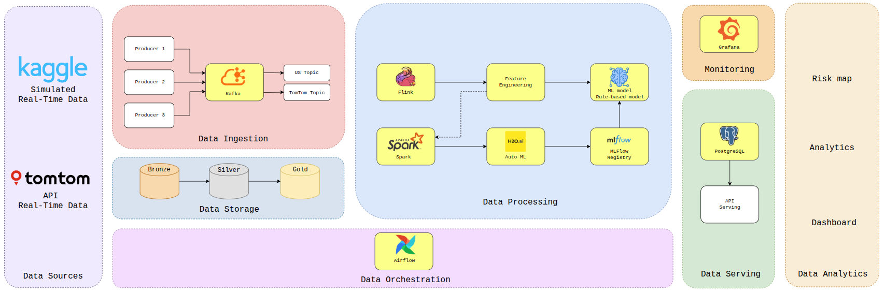

<div align="center">

# 🚦 Traffic Risk Assessment Platform

### Distributed Big Data & MLOps Platform for Real-Time Traffic Accident Severity Prediction

<p>
  
  
  
  
  
  
  
  
  
  
  
  
</p>

</div>

---

## 📋 Table of Contents

- [Overview](#-overview)
- [Problem Statement](#-problem-statement)
- [Team Members](#-team-members)
- [Architecture](#-architecture)
- [Dataset Strategy](#-dataset-strategy)
- [EDA Highlights](#-eda-highlights)
- [Key Capabilities](#-key-capabilities)
- [Tech Stack](#-tech-stack)
- [Repository Structure](#-repository-structure)
- [API Reference](#-api-reference)
- [Getting Started](#-getting-started)
- [Cloud Deployment](#-cloud-deployment)
- [Cloud Operations](#-cloud-operations)
- [Cloud Service URLs](#-cloud-service-urls)
- [Dashboard Features](#-dashboard-features)
- [Monitoring & Observability](#-monitoring--observability)
- [Limitations & Future Work](#-limitations--future-work)
- [References](#-references)

---

## 🎯 Overview

A production-grade Big Data platform for analyzing traffic risk from two coordinated data sources:

1. **US Accident Replay** — Post-2020 US accident records replayed as a real-time stream through Kafka → Flink → MLflow/H2O inference → PostgreSQL.
2. **Live TomTom Incidents** — Real-time traffic incidents from the TomTom API, enriched with rule-based severity scoring.

The system pre-trains on **~3M pre-2020 US accident records**, replays **~3.8M post-2020 records** as a simulated real-time stream, ingests live TomTom incidents, periodically retrains models from accumulated replay features, and exposes the full pipeline output through analytical APIs and an interactive dashboard.

---

## 🧩 Problem Statement

> **Given a traffic accident with its time, location, weather, and road context, predict its severity on a 4-level scale (`Severity 1 → 4`).**

This repository implements the **complete end-to-end data and ML pipeline**:

| Pipeline Stage | Description |
|---|---|
| **Ingestion** | US post-2020 CSV → Kafka topic `traffic.us.raw`; TomTom API → Kafka topic `traffic.tomtom.raw` |
| **Streaming** | Unified PyFlink job: US feature engineering + MLflow inference; TomTom enrichment + rule-based severity |
| **Serving Store** | US → PostgreSQL `traffic_risk_predictions`; TomTom → PostgreSQL `traffic_tomtom_incidents` |
| **Batch Processing** | Spark Silver → Gold: schema validation, deduplication, partitioning → Parquet/CSV |
| **Retraining** | Airflow-scheduled H2O AutoML retraining from Gold features → MLflow Model Registry |
| **Serving** | FastAPI REST APIs for predictions, hotspots, analytics, model info, system health |
| **Dashboard** | Next.js interactive map with replay/live/full modes, risk heatmaps, and analytical charts |
| **Monitoring** | Prometheus + Grafana for runtime health, Blackbox Exporter for endpoint probing |

---

## 👥 Team Members

| Member | Student ID |
|---|---|
| Nguyễn Hữu Hải Đăng | 23020524 |
| Phạm Huy Hiếu | 23020535 |
| Phạm Khánh Duy | 23020522 |
| Đặng Quốc Huy | 23020539 |
| Phạm Việt Hưng | 23020542 |

---

## 🏗 Architecture



### Cloud Topology — 3 Google Compute Engine VMs

| Node | Internal IP | External IP | Role | Key Services |
|---|---|---|---|---|
| `node1-control` | 10.128.0.4 | 35.224.149.110 | Control Plane | PostgreSQL/PostGIS, Airflow, MLflow, FastAPI, Next.js Dashboard, Prometheus, Grafana |
| `node2-streaming` | 10.128.0.9 | 34.46.107.159 | Streaming Plane | Kafka, Flink JobManager, Redis, US replay & TomTom producers |
| `node3-batch` | 10.128.0.8 | 34.63.78.147 | Batch Plane | Spark Master/Worker, H2O AutoML retraining |

### End-to-End Data Flow

```
┌─────────────────────────────────────────────────────────────────────┐
│                         OFFLINE TRAINING                            │
│  US pre-2020 Bronze CSV (GCS)                                      │
│    → Feature Engineering                                            │
│    → H2O AutoML Training                                           │
│    → MLflow Model Registry                                         │
└─────────────────────────────────────────────────────────────────────┘

┌─────────────────────────────────────────────────────────────────────┐
│                     REAL-TIME STREAMING (US)                        │
│  US post-2020 CSV (GCS)                                            │
│    → Kafka replay producer → topic: traffic.us.raw                 │
│    → Flink feature engineering + MLflow/H2O inference              │
│    → Silver JSONL + PostgreSQL traffic_risk_predictions             │
│    → Spark batch cleaning / dedup / partitioning                   │
│    → Gold Parquet + CSV                                            │
│    → H2O AutoML retraining (45-minute Airflow schedule)            │
│    → MLflow Model Registry (updated)                               │
└─────────────────────────────────────────────────────────────────────┘

┌─────────────────────────────────────────────────────────────────────┐
│                     REAL-TIME STREAMING (TomTom)                    │
│  TomTom Incident API                                               │
│    → Kafka TomTom producer → topic: traffic.tomtom.raw             │
│    → Flink enrichment + rule-based severity scoring                │
│    → PostgreSQL traffic_tomtom_incidents                            │
│                                                                     │
│  ⚠ TomTom uses magnitudeOfDelay + iconCategory for severity.       │
│    It is intentionally excluded from Spark, MLflow, and H2O.       │
└─────────────────────────────────────────────────────────────────────┘

┌─────────────────────────────────────────────────────────────────────┐
│                         SERVING LAYER                               │
│  PostgreSQL + MLflow + Prometheus                                  │
│    → FastAPI analytics & prediction APIs                           │
│    → Next.js Dashboard (interactive map + charts)                  │
│    → Grafana (infrastructure monitoring)                           │
└─────────────────────────────────────────────────────────────────────┘
```

---

## 📊 Dataset Strategy

The pipeline uses a **strict temporal split** to prevent data leakage:

| Split | Time Range | Records | Purpose |
|---|---|---:|---|
| `before_2020_raw` | 2016 – 2019 | 2,976,413 | Offline pretraining data |
| `from_2020_raw` | 2020 – 2023 | 3,786,927 | Real-time replay simulation |
| `before_2020_featured` | 2016 – 2019 | 2,975,837 | Engineered training set |

**Design principles:**
- `before 2020` → Offline model selection and initial training only
- `from 2020` → Replay simulation, online inference, and 45-minute retraining inputs
- No overlap ensures the model never sees future data during training

---

## 🔬 EDA Highlights

> Detailed EDA summary: [ml/notebooks/eda.md](ml/notebooks/eda.md)

Key findings that shaped modeling decisions:

1. **Clean temporal split** — No overlap between training (pre-2020) and replay (post-2020) data.
2. **Stable feature engineering** — `before_2020_raw` and `before_2020_featured` differ by only a small number of rows due to null filtering.
3. **Severe class imbalance** — Before 2020: class 2 = 67.03%, class 3 = 29.84%, class 4 = 3.10%, class 1 = 0.03%.
4. **Informative signals** — Weather, road type, time-of-day, night/rush-hour features all contribute meaningful structure.
5. **Temporal drift** — Label distribution shifts after 2020, reinforcing the need for periodic retraining.

---

## ⚡ Key Capabilities

| Layer | Capability |
|---|---|
| **Ingestion** | Reads post-2020 CSV rows → Kafka topic `traffic.us.raw`; polls TomTom API → `traffic.tomtom.raw` |
| **Streaming** | Single unified Flink job processes both US and TomTom Kafka topics in parallel |
| **ML Inference** | US events: H2O model served via MLflow; TomTom: rule-based severity from delay/icon signals |
| **Batch** | Spark validates schema, fills defaults, removes duplicates, writes Gold Parquet/CSV |
| **Retraining** | H2O AutoML trains/retrains severity models; MLflow logs experiments and tracks model versions |
| **Orchestration** | Airflow triggers 45-minute retraining and 2-minute stream health-check DAGs |
| **Serving** | FastAPI exposes overview, prediction, hotspot, analytics, system, model, and pipeline endpoints |
| **Dashboard** | Next.js interactive map with 3 modes (Replay ●, Live ▲, Full ●▲), heatmaps, and analytical charts |
| **Monitoring** | Prometheus + Grafana collect runtime metrics; Blackbox Exporter probes service endpoints |

---

## 🛠 Tech Stack

| Category | Technologies |
|---|---|
| **Data Processing** | Apache Kafka, Apache Flink (PyFlink), Apache Spark |
| **ML Lifecycle** | H2O AutoML, MLflow Model Registry & Serving |
| **Backend** | FastAPI (Python), PostgreSQL + PostGIS, Redis |
| **Frontend** | Next.js 14, React, Recharts, MapLibre GL |
| **Orchestration** | Apache Airflow |
| **Monitoring** | Prometheus, Grafana, Blackbox Exporter |
| **Infrastructure** | Docker Compose, Google Compute Engine, Google Cloud Storage |
| **Deployment** | Manual Git + `gcloud` sync, VM startup scripts, Docker Compose |
| **Language** | Python 3.10+ |

---

## 📁 Repository Structure

```
traffic-risk-assessment/
├── assets/                          # Architecture diagrams and visual assets
├── config/
│   └── monitoring/                  # Prometheus, Grafana, Blackbox Exporter configs
├── dashboard/
│   ├── backend/                     # FastAPI backend (routes, services, core)
│   │   └── app/
│   │       ├── core/                #   Database, config, runtime cache
│   │       ├── routes/              #   API route handlers
│   │       ├── schemas/             #   Pydantic schemas
│   │       └── services/            #   Business logic (predictions, analytics, hotspots)
│   └── frontend/                    # Next.js 14 dashboard
│       ├── app/                     #   Pages (main dashboard, pipeline, scenario)
│       ├── components/              #   Reusable components (RiskMap, DataState)
│       └── lib/                     #   API client, types, utilities
├── data/                            # Data directory (CSV, JSONL, Parquet)
├── deployment/
│   ├── node1-control/               # Docker Compose + Dockerfiles for control plane
│   ├── node2-streaming/             # Docker Compose for streaming plane
│   └── node3-batch/                 # Docker Compose for batch plane
├── docs/                            # Technical documentation and runbooks
│   ├── intro.md                     #   Project introduction
│   ├── run.md                       #   Full cloud runbook
│   ├── api.md                       #   API documentation
│   ├── pipeline.md                  #   Pipeline documentation
│   ├── report.md                    #   Technical report
│   └── ...
├── ingestion/
│   └── kafka/                       # Kafka replay producer for US data
├── ml/
│   ├── notebooks/                   # EDA notebook and markdown summary
│   └── training/                    # H2O training and retraining scripts
├── orchestration/
│   └── dags/                        # Airflow DAGs (retraining, health checks)
├── processing/                      # Shared feature engineering, Flink, and Spark jobs
│   └── flink_streaming.py           #   Unified Flink streaming job
├── scripts/
│   ├── gcp/                         # Cloud provisioning and node operations
│   └── local/                       # Local smoke pipeline runner
├── shared/                          # Shared utilities across components
├── tests/                           # Unit and smoke tests
├── vendor/                          # Reference projects from previous cohorts
├── docker-compose.yaml              # Root compose (local development)
├── pyproject.toml                   # Python project configuration
├── requirements.txt                 # Python dependencies
└── README.md                        # This file
```

---

## 📡 API Reference

The FastAPI backend exposes the following endpoint groups:

| Group | Endpoints | Description |
|---|---|---|
| **Health** | `GET /health`, `GET /metrics` | Service health check and Prometheus metrics |
| **Overview** | `GET /api/v1/overview/summary` | Dashboard KPIs: total events, high-risk count, avg risk, model info |
| **Predictions** | `GET /api/v1/predictions/map`, `/latest`, `/{event_id}` | Map points, recent predictions, event details |
| **Hotspots** | `GET /api/v1/hotspots`, `/nearby` | Risk hotspot ranking and proximity search |
| **Scenarios** | `POST /api/v1/scenarios/predict`, `/compare` | What-if scenario analysis |
| **Analytics** | `GET /api/v1/analytics/risk-by-hour`, `/severity-distribution`, `/weather-histogram`, `/timeseries` | Aggregated analytical charts |
| **Model** | `GET /api/v1/model/info`, `/retrain-history`, `/performance-trend` | MLflow model info and performance history |
| **Pipeline** | `GET /api/v1/pipeline/throughput`, `/latency`, `/checkpoints`, `/replay-health` | Pipeline health and performance metrics |
| **System** | `GET /api/v1/system/status` | System-wide status check |

### Quick Test

```bash
# Health check
curl -fsS http://35.224.149.110:8000/health

# System status
curl -fsS http://35.224.149.110:8000/api/v1/system/status

# Overview summary (modes: replay, live, full)
curl -fsS "http://35.224.149.110:8000/api/v1/overview/summary?mode=full"

# Interactive API docs
open http://35.224.149.110:8000/docs
```

---

## 🚀 Getting Started

### Prerequisites

- Python `3.10+`
- Docker + Docker Compose v2
- `uv` (Python package manager)

### Local Setup

```bash
# Clone the repository
git clone git@github.com:HungPhamNoob/traffic-risk-assessment.git
cd traffic-risk-assessment

# Copy environment file
cp .env.example .env

# Install dependencies
uv sync --group dev
```

### Local Validation

```bash
# Run linting + unit tests
make -f makefile/local/Makefile validate

# Run local smoke pipeline (subset of data)
make -f makefile/local/Makefile pipeline

# Full local pipeline with bounded training
LOCAL_SAMPLE_ROWS=0 LOCAL_RUN_TRAINING=true \
make -f makefile/local/Makefile full-pipeline
```

### Useful Local Targets

```bash
make -f makefile/local/Makefile up                # Start all local services
make -f makefile/local/Makefile up-batch           # Start batch processing services
make -f makefile/local/Makefile up-orchestration   # Start Airflow
make -f makefile/local/Makefile logs               # Tail logs
make -f makefile/local/Makefile reset-realtime     # Reset and restart realtime pipeline
```

> **Note:** This project is **cloud-first**. For full end-to-end runs, use the cloud pipeline. Keep local execution limited to validation or smoke checks. See [docs/run.md](docs/run.md) for the full cloud runbook.

---

## ☁ Cloud Deployment

This project targets the `big-data-group-4` GCP project.

### Deploy All Nodes

```bash
# Validate deployment manifests
make -f makefile/gcp/Makefile validate

# List VMs
make -f makefile/gcp/Makefile list

# Deploy all 3 nodes
make -f makefile/gcp/Makefile deploy-all
```

### Full Pipeline Reset & Run

```bash
# Reset everything and run the full pipeline from scratch
BRANCH=main make -f makefile/gcp/Makefile full-reset-run

# Reset and run realtime-only (replay + live streaming)
BRANCH=main make -f makefile/gcp/Makefile full-reset-run-realtime
```

### Collect Evidence

```bash
# Capture measured metrics and service check results
make -f makefile/gcp/Makefile collect-metrics
```

Results are saved to `logs/cloud_runs/<run-id>/service-checks.md`.

### Manual Update Flow (no CI/CD)

This repository is designed to be updated directly onto the 3 VMs without a CI/CD pipeline:

```bash
# 1) update the shared cloud env file
gcloud storage cp .env.cloud gs://big-data-group-4-bronze/env/.env.cloud

# 2) update the control plane
gcloud compute ssh node1-control --zone=us-central1-a --project=big-data-group-4 \
  --command='cd /opt/traffic && git pull --ff-only origin main && bash scripts/gcp/run-node1.sh'

# 3) update streaming and batch nodes
gcloud compute ssh node2-streaming --zone=us-central1-a --project=big-data-group-4 \
  --command='cd /opt/traffic && git pull --ff-only origin main && bash scripts/gcp/run-node2.sh'

gcloud compute ssh node3-batch --zone=us-central1-a --project=big-data-group-4 \
  --command='cd /opt/traffic && git pull --ff-only origin main && bash scripts/gcp/run-node3.sh'
```

`run-node1.sh` republishes the active `.env.cloud` to GCS and repairs inter-node SSH access for Node 2 and Node 3. `run-node2.sh` and `run-node3.sh` refresh their local `.env.cloud` from GCS before starting services, so the runtime config does not drift across VMs.

---

## 🔧 Cloud Operations

### Start/Repair Running Stack

```bash
# Node 1 - Control plane
gcloud compute ssh node1-control --zone=us-central1-a --project=big-data-group-4 \
  --command='cd /opt/traffic && git pull --ff-only origin main && bash scripts/gcp/run-node1.sh'

# Node 2 - Streaming plane
gcloud compute ssh node2-streaming --zone=us-central1-a --project=big-data-group-4 \
  --command='cd /opt/traffic && git pull --ff-only origin main && bash scripts/gcp/run-node2.sh'

# Node 3 - Batch plane
gcloud compute ssh node3-batch --zone=us-central1-a --project=big-data-group-4 \
  --command='cd /opt/traffic && git pull --ff-only origin main && NODE3_WAIT_FOR_SILVER_SECONDS=600 bash scripts/gcp/run-node3.sh'

# Node 3 - Spark only (let Airflow trigger retraining)
gcloud compute ssh node3-batch --zone=us-central1-a --project=big-data-group-4 \
  --command='cd /opt/traffic && git pull --ff-only origin main && NODE3_RUN_BATCH_PIPELINE=false bash scripts/gcp/run-node3.sh'
```

### Operational Commands

```bash
make -f makefile/gcp/Makefile status              # Check all node statuses
make -f makefile/gcp/Makefile kafka-topic-check    # Inspect Kafka topics
make -f makefile/gcp/Makefile reset-realtime       # Reset realtime pipeline only
```

### Always-on Mode (auto-start on VM boot)

Each VM can auto-start its services as soon as it boots, so the dashboard stays online
even if your laptop is off. The startup scripts in `scripts/gcp/startup-node*.sh` now:

1. refresh `/opt/traffic` from GitHub,
2. refresh `.env.cloud` from `gs://big-data-group-4-bronze/env/.env.cloud`,
3. launch the corresponding `run-node*.sh` script.

```bash
# Attach startup scripts to the VMs (run from your local machine)
gcloud compute instances add-metadata node1-control --zone=us-central1-a --project=big-data-group-4 \
  --metadata-from-file startup-script=scripts/gcp/startup-node1.sh

gcloud compute instances add-metadata node2-streaming --zone=us-central1-a --project=big-data-group-4 \
  --metadata-from-file startup-script=scripts/gcp/startup-node2.sh

gcloud compute instances add-metadata node3-batch --zone=us-central1-a --project=big-data-group-4 \
  --metadata-from-file startup-script=scripts/gcp/startup-node3.sh
```

Startup logs are written to `/var/log/traffic/node*-bootstrap.log` on each VM.

### Progressive Retraining Strategy

The system uses a **progressive retraining** approach: Airflow checks every 45 minutes, but Node 3 only retrains when the Silver feature snapshot has changed. This deliberately removes the old `RETRAIN_MIN_US_ROWS=3,000,000` gate; the correct trigger is **new Silver data**, not a fixed replay row count.

- **Silver freshness gate**: Node 3 builds a deterministic GCS object manifest for `SILVER_FEATURES_PATH`. If it matches the last successful manifest, the run exits cleanly without Spark/H2O work.
- **Successful watermark**: The Silver manifest is recorded only after Spark writes Gold data and H2O AutoML finishes successfully. A failed retrain does not advance the watermark.
- **Cumulative training set**: Every successful Spark run writes Gold features that include **old + new replay data**. Retraining is therefore cumulative, not "new data only" training.
- **No forced reset on scheduled ticks**: the Airflow DAG must not wipe local Silver/Gold snapshots on every schedule tick. Forced reset is reserved for manual recovery or full replay reset operations only.
- **Batch completeness contract**: one successful retrain batch means **one parent MLflow run + the full top-k leaderboard set** (`top1 ... top10` by default). A partial parent run is treated as incomplete and must not count toward the finished loop.
- **Container-safe local snapshots**: Node 3 writes Gold data through Spark containers mounted onto `/opt/traffic/data`. The host snapshot directories therefore need container-writable permissions before Spark starts, otherwise `_temporary/.../event_year=*` writes fail on the bind mount.
- **Model metrics contract**: Each retrain logs top model runs plus the registered best model metrics (`accuracy`, `weighted_f1`, `weighted_recall`, `weighted_precision`) to MLflow so the dashboard does not show a finished retrain with missing core metrics.
- **MLflow run contract**: each scheduled retrain logs one parent run (`h2o_retrain_online`) and up to top-10 nested leaderboard runs (`retrain_top1_*` ... `retrain_top10_*`) with a shared `retrain_batch_id`.
- `RETRAIN_MIN_US_ROWS`: **Set to 0 by default** (gate disabled). The row-count threshold proved to be an anti-pattern — during replay, data streams in continuously, so checking for *new* Silver objects is more accurate than checking for a minimum row count. If you want to re-enable, set to a positive integer in `.env.cloud`.
- `RETRAIN_ALLOW_IF_COUNT_UNAVAILABLE`: set to `true` to continue retrain even if the row-count API is unreachable.

**Recommended Node 3 retrain profile (`/opt/traffic/.env.cloud`):**
- `NODE3_H2O_MAX_RUNTIME=900` keeps one retrain tick comfortably inside the 45-minute Airflow cadence, and Node 3 now ignores the generic `H2O_MAX_RUNTIME` setting so a local/offline value cannot silently stretch cloud retrains back to one hour.
- `NODE3_H2O_MAX_MEM=4G` is the practical upper bound on the current batch VM; higher heap values risk host-level OOM kills.
- `H2O_TRAIN_MAX_ROWS=500000` bounds the active training frame size while preserving the cumulative Gold snapshot on disk.
- `H2O_BALANCE_CLASSES=false` avoids duplicating rows in-memory on the small VM; class imbalance is still visible in metrics, but the retrain loop remains stable.
- `H2O_MAX_RUNTIME_SECS_PER_MODEL=90`, `H2O_NFOLDS=0`, and `H2O_EXCLUDE_ALGOS=DeepLearning,StackedEnsemble,XGBoost` keep AutoML focused on CPU-friendly models that can reliably produce a full top-10 leaderboard.

**Troubleshooting the cloud retrain loop:**
- If Spark fails writing `incremental_batches/<batch_id>`, make sure `run-node3.sh` recreates the local Gold directories with container-writable permissions before `spark-submit`.
- If the latest parent MLflow run stays `RUNNING` after the process died, restart Node 3 with a clean lock/PID state and validate the next parent run rather than counting the stale run.
- If H2O logs `Unblock allocations ... OOM`, lower `H2O_TRAIN_MAX_ROWS` first before increasing heap; the VM runs more reliably with a smaller sampled frame than with a larger JVM. The cloud default is now `500000` rows for that reason.
- After any batch-side change, rerun `scripts/gcp/run-node3.sh`, then verify `/api/v1/model/retrain-history` and `/api/v1/pipeline/replay-health` before trusting the dashboard.

**How it works:**
1. Node 2 streams US post-2020 data through Kafka → Flink → PostgreSQL `traffic_risk_predictions` + Silver JSONL to GCS
2. Airflow DAG `model_retrain_hourly` triggers every 45 minutes (`*/45 * * * *`)
3. Node 3 acquires a mutex lock, then compares the current Silver manifest with the last successful manifest
4. If new Silver files exist → Spark Silver→Gold → H2O AutoML training → full top-k MLflow logging → Model Registry update
5. If no new Silver files → exits cleanly (no wasted compute)
6. Flink auto-loads `traffic-risk-model/latest` on each checkpoint cycle
7. Model quality improves as more post-2020 replay data accumulates

The dashboard pipeline page reports `Retrain loop: CONTINUE / FINISHED / FAILED`, source row counts, retrain batch completeness, and the `new_silver_data_only` policy.

- `CONTINUE`: new replay or live data is still arriving, or the system has not yet completed the minimum successful retrain batches.
- `FINISHED`: all tracked streams are idle for multiple schedule windows and at least the minimum successful retrain batches have completed.
- `FAILED`: the latest root retrain batch failed and no newer successful root retrain batch has replaced it yet.

The retrain loop auto-recovers on the next Airflow schedule if any transient failure occurs (network timeout, OOM, lock contention).

### Updating Cloud Nodes Without CI/CD

This project can be updated directly on the running VMs without a CI/CD pipeline.

1. Sync code to the target VM (`node1-control`, `node2-streaming`, `node3-batch`) with `gcloud compute scp` or `git pull`.
2. Keep `/opt/traffic/.env.cloud` as the runtime source of truth.
3. Rebuild only the affected service instead of restarting the whole cluster:
   - `node1-control`: rebuild `fastapi` when backend code changes; restart `airflow` and `airflow-scheduler` when DAG files change.
   - `node2-streaming`: rerun `scripts/gcp/run-node2.sh` only when streaming code or compose config changes.
   - `node3-batch`: rerun `scripts/gcp/run-node3.sh` for manual retrain validation after batch-side code changes.
4. Verify the dashboard, MLflow, and Airflow after every update before sharing the build with the team.

---

## 🌐 Cloud Service URLs

| Service | URL | Node | Credentials |
|---|---|---|---|
| **Next.js Dashboard** | http://35.224.149.110:3001 | node1 | — |
| **FastAPI Backend** | http://35.224.149.110:8000 | node1 | — |
| **FastAPI Swagger Docs** | http://35.224.149.110:8000/docs | node1 | — |
| **MLflow Tracking UI** | http://35.224.149.110:5000 | node1 | — |
| **MLflow Model Serving** | http://35.224.149.110:5001/invocations | node1 | — |
| **Airflow Webserver** | http://35.224.149.110:8080 | node1 | admin / admin |
| **Prometheus** | http://35.224.149.110:9090 | node1 | — |
| **Grafana** | http://35.224.149.110:3000 | node1 | admin / admin |
| **Blackbox Exporter** | http://35.224.149.110:9115 | node1 | — |
| **PostgreSQL** | 35.224.149.110:5432 | node1 | see `.env.cloud` |
| **Flink JobManager UI** | http://34.46.107.159:8081 | node2 | — |
| **Kafka Broker** | 34.46.107.159:9092 | node2 | — |
| **Spark Master UI** | http://34.63.78.147:8080 | node3 | — |

---

## 📊 Dashboard Features

The Next.js dashboard provides three viewing modes:

| Mode | Symbol | Data Source | Description |
|---|---|---|---|
| **Replay** | ● | US post-2020 accidents | Historical replay data with H2O model inference |
| **Live** | ▲ | TomTom real-time incidents | Live traffic incidents with rule-based severity |
| **Full** | ●▲ | Replay + Live | Strict sum of US replay rows and TomTom live incidents |

`full` must always equal `replay + live`. The backend therefore queries both serving tables and merges the results instead of treating `full` as a separate stored dataset.

### Dashboard Components

- **KPI Cards** — Total events, high-risk count, average risk score, latest event time, active model info, model metrics (accuracy, precision, recall, F1)
- **Interactive Risk Map** — MapLibre GL map with heatmap overlay, min-risk filter slider, click-to-inspect
- **Hotspot Ranking** — Top 10 highest-risk geographic cells, sortable by average risk score
- **Risk by Hour** — Line chart showing average risk across 24 hours
- **Severity Distribution** — Bar chart of 4-class severity counts
- **Weather Histograms** — Temperature, humidity, and wind speed distributions
- **Latest Predictions Table** — Most recent predictions with event ID, risk score, severity, timestamp, and model status
- **Scenario Analysis** — What-if prediction tool with preset scenarios (Normal commute, Rainy rush hour, Night junction)
- **Pipeline Controls** — System status, throughput, latency, replay health, full pipeline reset

---

## 📈 Monitoring & Observability

| Tool | Purpose | Access |
|---|---|---|
| **Prometheus** | Time-series metrics collection | http://35.224.149.110:9090 |
| **Grafana** | Dashboards and alerting | http://35.224.149.110:3000 |
| **Blackbox Exporter** | External endpoint probing | http://35.224.149.110:9115 |
| **FastAPI `/metrics`** | Application-level Prometheus metrics | http://35.224.149.110:8000/metrics |

Prometheus scrapes metrics from FastAPI, Blackbox Exporter, and other configured targets. Grafana provides pre-configured dashboards for pipeline health visualization.

---

## ⚠ Limitations & Future Work

### Current Limitations

- **Class imbalance** — Severity class 1 represents only 0.03% of training data, making it extremely difficult to predict
- **TomTom severity** — Rule-based scoring (not ML); intentionally excluded from H2O/MLflow pipeline
- **Single region** — All 3 VMs run in `us-central1-a`; no multi-region redundancy
- **Model serving** — MLflow serving requires model availability; cold starts can delay inference

### Future Improvements

- Multi-region GKE deployment for high availability
- Real-time model A/B testing framework
- Streaming analytics with Flink SQL for complex event processing
- Enhanced class imbalance handling (SMOTE, focal loss)
- Alerting pipeline for high-risk event notifications

---

## 📚 References

- **US Accidents Dataset Paper**: [https://arxiv.org/pdf/1906.05409](https://arxiv.org/pdf/1906.05409)
- **TomTom Traffic API**: [https://developer.tomtom.com/traffic-api](https://developer.tomtom.com/traffic-api)
- **Project EDA Summary**: [ml/notebooks/eda.md](ml/notebooks/eda.md)
- **Cloud Runbook**: [docs/run.md](docs/run.md)
- **API Documentation**: [docs/api.md](docs/api.md)
- **Technical Report**: [docs/report.md](docs/report.md)
- **Pipeline Documentation**: [docs/pipeline.md](docs/pipeline.md)

---

<div align="center">
  <sub>Built with ❤️ by Team Big Data Group 4 — VNU University of Engineering and Technology</sub>
</div>
