# EDA (US.csv)

EDA này so sánh 3 tập dữ liệu chính:

| Ký hiệu | Ý nghĩa |
| --- | --- |
| `before_2020_raw` | Dữ liệu raw trước năm 2020, dùng cho offline training |
| `from_2020_raw` | Dữ liệu raw từ năm 2020 trở đi, dùng cho streaming replay |
| `before_2020_featured` | Dữ liệu trước 2020 sau khi qua feature engineering |

Lý do không có after_2020_featured vì nó là dữ liệu realtime, dù có phân tích thì cũng không được áp dụng phân tích của nó cho feat eng, tránh data leakage. Chỉ được dùng feat eng của before2020 áp dụng lên after2020.

Mục tiêu của EDA là kiểm tra:

- dữ liệu có đúng split thời gian không,
- feature engineering có giữ đúng schema không,
- label `true_severity` có bị imbalance không,
- các feature thời tiết, thời gian, đường, vị trí có ý nghĩa không,
- có dấu hiệu data drift giữa trước và sau 2020 không.

Nguồn EDA kiểm tra 3 view dữ liệu trên cùng schema engineered gồm 26 cột, trong đó raw file ban đầu có 7,728,394 dòng, sau chuẩn hóa còn 6,763,340 dòng hợp lệ cho EDA.

---

# 1. Tổng quan dữ liệu

| Tập dữ liệu | Số dòng | Số cột | Năm bắt đầu | Năm kết thúc | Vai trò |
| --- | --- | --- | --- | --- | --- |
| `before_2020_raw` | 2,976,413 | 26 | 2016 | 2019 | Dữ liệu raw trước 2020 |
| `from_2020_raw` | 3,786,927 | 26 | 2020 | 2023 | Dữ liệu replay realtime |
| `before_2020_featured` | 2,975,837 | 26 | 2016 | 2019 | Dữ liệu train sau feature engineering |

## Đánh giá

`before_2020_raw` và `before_2020_featured` gần như bằng nhau về số dòng. Điều này cho thấy bước feature engineering không làm mất nhiều dữ liệu. Đây là dấu hiệu tốt vì pipeline xử lý dữ liệu ổn định.

Số dòng của `from_2020_raw` lớn hơn `before_2020_raw`, tức là giai đoạn replay sau 2020 có lượng accident records lớn hơn. Tuy nhiên, phân phối severity của giai đoạn này khác rất nhiều, nên không nên trộn trực tiếp dữ liệu trước và sau 2020 nếu chưa xử lý drift.

---

# 2. Biểu đồ Accident Count by Year

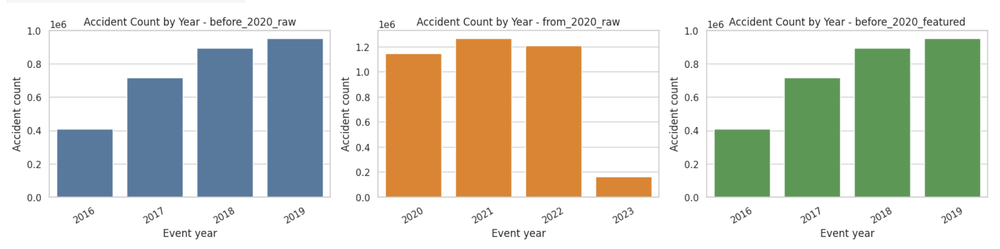

## Nhận xét theo biểu đồ

| Giai đoạn | Xu hướng |
| --- | --- |
| 2016 → 2019 | Số accident tăng đều qua từng năm |
| 2020 → 2022 | Số accident rất cao, cao hơn giai đoạn trước 2020 |
| 2023 | Số accident giảm mạnh |

## Đánh giá

Ở giai đoạn trước 2020:

| Năm | Số accident |
| --- | --- |
| 2016 | 410,821 |
| 2017 | 717,868 |
| 2018 | 893,423 |
| 2019 | 954,301 |

Dữ liệu tăng đều từ 2016 đến 2019, cho thấy tập before-2020 đủ lớn để pretrain model.

Ở giai đoạn sau 2020:

| Năm | Số accident |
| --- | --- |
| 2020 | 1,145,516 |
| 2021 | 1,268,272 |
| 2022 | 1,209,705 |
| 2023 | 163,434 |

Năm 2023 thấp bất thường. Không nên kết luận rằng tai nạn giảm thật, vì khả năng cao dữ liệu 2023 chưa đầy đủ hoặc chỉ gồm một phần năm.

## Kết luận

Temporal split là hợp lý:

```
before 2020  -> offline training
from 2020    -> streaming replay / online simulation
```

Điểm này giúp giảm data leakage.

---

# 3. Biểu đồ Severity Share và Severity Count

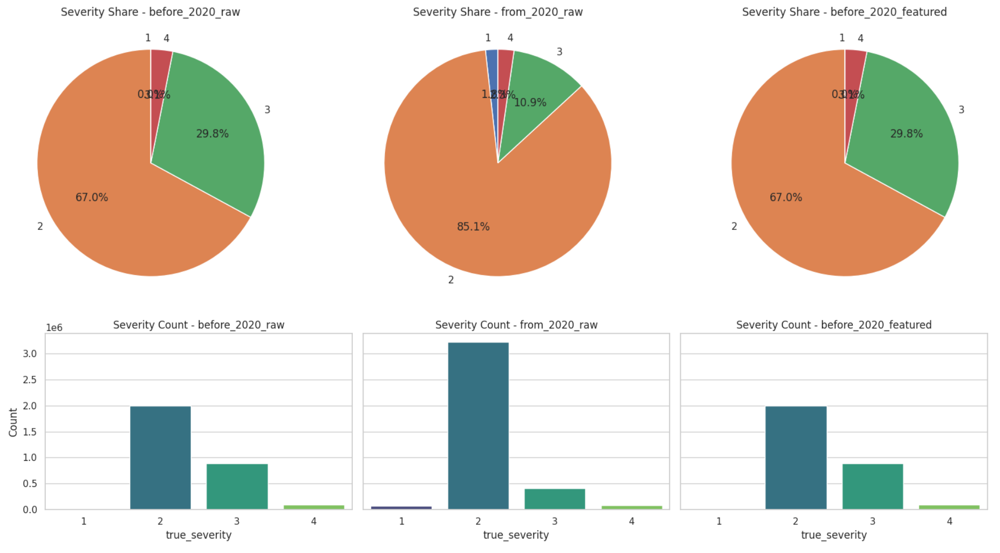

## Bảng phân phối severity

| Severity | before_2020_raw | Tỷ lệ | from_2020_raw | Tỷ lệ | before_2020_featured | Tỷ lệ |
| --- | --- | --- | --- | --- | --- | --- |
| 1 | 969 | 0.03% | 66,394 | 1.75% | 969 | 0.03% |
| 2 | 1,995,128 | 67.03% | 3,222,878 | 85.11% | 1,994,654 | 67.03% |
| 3 | 887,928 | 29.83% | 411,377 | 10.86% | 887,867 | 29.84% |
| 4 | 92,388 | 3.10% | 86,278 | 2.28% | 92,347 | 3.10% |

## Nhận xét chính

Severity 2 chiếm đa số tuyệt đối trong cả hai giai đoạn. Trước 2020, severity 2 chiếm khoảng 67%. Sau 2020, severity 2 tăng lên hơn 85%.

Severity 1 cực kỳ hiếm trong before-2020, chỉ có 969 dòng, tương đương khoảng 0.03%. Đây là nguyên nhân chính khiến model gần như không học được class 1.

## Mức độ mất cân bằng dữ liệu

| Tập dữ liệu | Majority class | Minority class | Tỷ lệ majority/minority |
| --- | --- | --- | --- |
| `before_2020_raw` | Severity 2 | Severity 1 | 2058.96 lần |
| `from_2020_raw` | Severity 2 | Severity 1 | 48.54 lần |
| `before_2020_featured` | Severity 2 | Severity 1 | 2058.47 lần |

## Đánh giá

Đây là dataset imbalance rất nặng. Với before-2020 training set, class 2 nhiều hơn class 1 hơn 2000 lần. Vì vậy, nếu chỉ nhìn accuracy thì rất dễ bị đánh lừa.

Ví dụ, model đoán nhiều về severity 2 vẫn có accuracy cao, nhưng có thể bỏ sót hoàn toàn severity 1 và severity 4.

## Kết luận

Bắt buộc phải báo cáo:

- Macro F1
- Weighted F1
- Recall từng severity
- Confusion matrix
- Support từng class

Không nên chỉ báo cáo accuracy.

---

# 4. Missing values và data quality

## Nhận xét

Các engineered features đều có missing rate bằng 0.

Điều này nghĩa là sau khi qua feature engineering:

- `event_id` không null,
- `true_severity` không null,
- `lat`, `lon` không null,
- weather features không null,
- road/context flags không null.

## Đánh giá

Đây là điểm mạnh của pipeline. Feature engineering đã chuẩn hóa dữ liệu tốt trước khi đưa vào model.

Các giá trị thiếu ở raw data đã được xử lý bằng:

- default value: Gán giá trị trung bình/0 nếu thiếu
- clipping: Cắt về biên vật lý nếu outlier
- boolean conversion: Mọi giá trị → 0 hoặc 1
- validation critical fields: Loại bỏ dòng nếu không hợp lệ

## Kết luận

Schema hiện tại đủ ổn định cho cả:

```
Flink realtime inference
Spark batch retraining
H2O AutoML training
```

---

# 5. Histogram thời tiết: temperature, humidity, wind speed, visibility

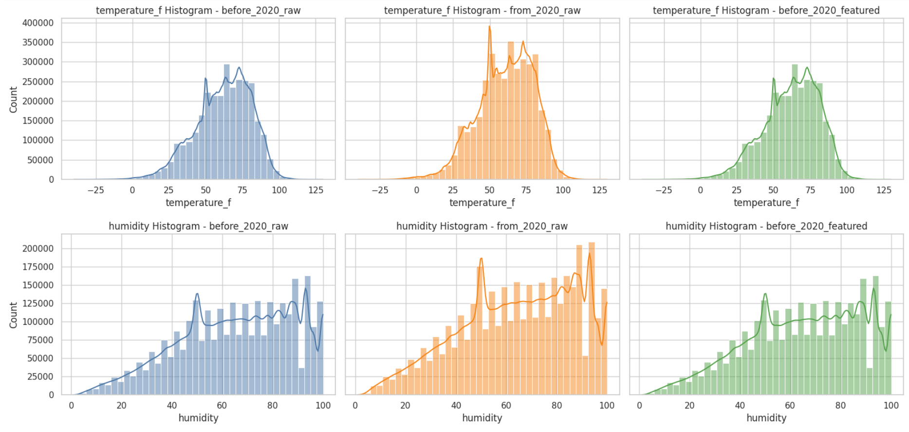

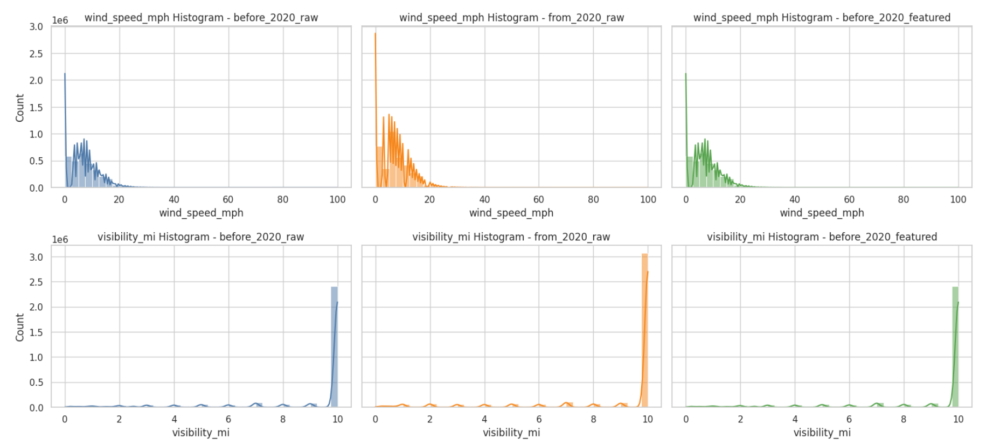

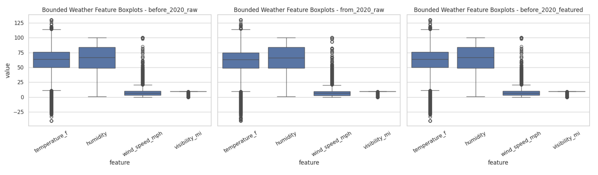

## 5.1 Temperature

| Tập | Mean | Median | Min | Max |
| --- | --- | --- | --- | --- |
| before_2020_raw | 62.11 | 64.0 | -40 | 130 |
| from_2020_raw | 60.77 | 63.0 | -40 | 130 |
| before_2020_featured | 62.11 | 64.0 | -40 | 130 |

## Nhận xét

Phân phối temperature tập trung khoảng 50-80°F. Hai tập before raw và before featured gần như giống nhau, chứng minh feature engineering giữ phân phối ổn định.

Giá trị min/max bị chặn trong khoảng `-40` đến `130`, đúng với logic clipping.

---

## 5.2 Humidity

| Tập | Mean | Median | Min | Max |
| --- | --- | --- | --- | --- |
| before_2020_raw | 65.10 | 67.0 | 1 | 100 |
| from_2020_raw | 64.45 | 66.0 | 1 | 100 |
| before_2020_featured | 65.10 | 67.0 | 1 | 100 |

## Nhận xét

Humidity phân bố rộng, nhưng tập trung nhiều ở vùng 50-100%. Đây là phân phối hợp lý vì nhiều tai nạn xảy ra trong điều kiện độ ẩm trung bình đến cao.

---

## 5.3 Wind speed

| Tập | Mean | Median | Min | Max |
| --- | --- | --- | --- | --- |
| before_2020_raw | 7.07 | 6.9 | 0 | 100 |
| from_2020_raw | 7.11 | 7.0 | 0 | 100 |
| before_2020_featured | 7.07 | 6.9 | 0 | 100 |

## Nhận xét

Wind speed lệch phải mạnh. Phần lớn giá trị nằm ở vùng thấp, khoảng 0-15 mph. Một số outlier được clip ở 100 mph.

Điều này hợp lý vì gió cực mạnh hiếm gặp.

---

## 5.4 Visibility

| Tập | Mean | Median | Min | Max |
| --- | --- | --- | --- | --- |
| before_2020_raw | 9.07 | 10.0 | 0 | 10 |
| from_2020_raw | 9.04 | 10.0 | 0 | 10 |
| before_2020_featured | 9.07 | 10.0 | 0 | 10 |

## Nhận xét

Visibility có spike rất lớn ở 10 miles. Đây là giá trị phổ biến trong weather reports khi tầm nhìn bình thường.

## Kết luận nhóm weather features

Các feature thời tiết đã được bounded hợp lý:

| Feature | Range sau xử lý |
| --- | --- |
| `temperature_f` | -40 đến 130 |
| `humidity` | 0 đến 100 |
| `wind_speed_mph` | 0 đến 100 |
| `visibility_mi` | 0 đến 10 |

Điều này giúp model tránh bị ảnh hưởng bởi outlier vật lý không hợp lý.

---

# 6. Biểu đồ Accident Count by Hour

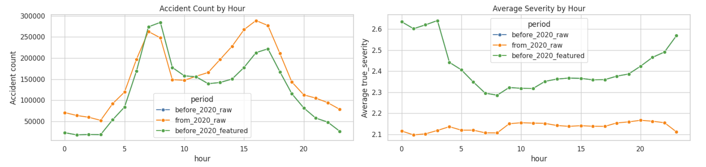

## Nhận xét

Số accident tăng mạnh vào các khung giờ di chuyển trong ngày.

Trước 2020, số lượng accident cao quanh:

- 7h-8h sáng,
- 16h-17h chiều.

Sau 2020, số accident cũng cao trong giờ ban ngày và chiều.

## Đánh giá

Feature `is_rush_hour` là hợp lý vì biểu đồ cho thấy accident count có pattern theo giờ rõ ràng.

Tuy nhiên, cần chú ý: nhiều accident xảy ra trong rush hour không có nghĩa là accident trong rush hour luôn nghiêm trọng hơn. Nó chỉ nói rằng số lượng vụ tai nạn nhiều hơn.

---

# 7. Biểu đồ Average Severity by Hour

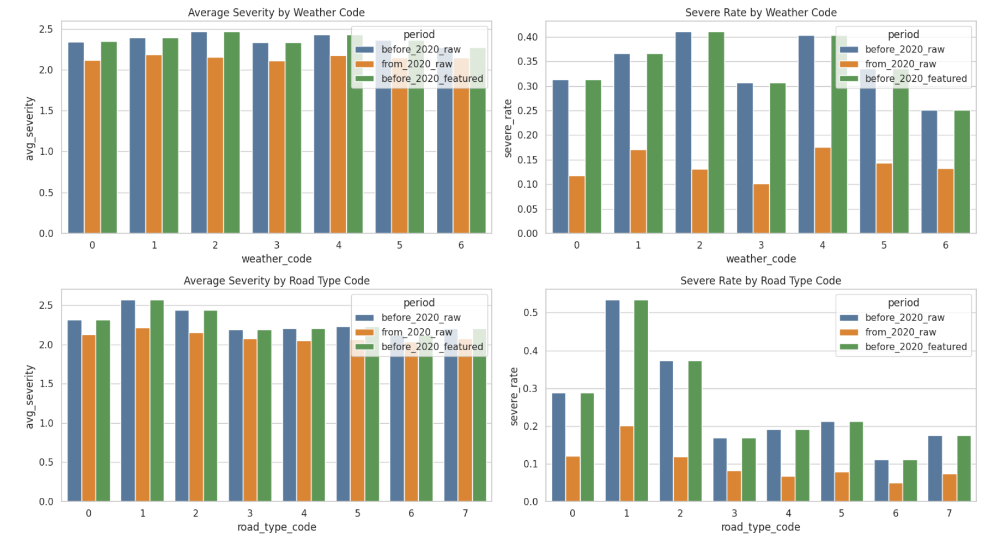

## Nhận xét

Trước 2020, average severity cao hơn vào ban đêm và rạng sáng. Một số giờ như 0h-3h có average severity cao hơn ban ngày.

Sau 2020, average severity thấp và ổn định hơn, quanh khoảng 2.1.

## Đánh giá

Điều này giải thích vì sao `hour` và `is_night` nên được giữ lại. Chúng có thể không có correlation tuyến tính quá mạnh, nhưng có thể kết hợp với road type, weather, location để giúp tree-based model học pattern.

---

# 8. Rush hour và weekend

Bảng tóm tắt

| Period | Rush hour | Weekend | Accident count | Avg severity | Severe rate |
| --- | --- | --- | --- | --- | --- |
| before_2020_raw | 0 | 0 | 1,410,389 | 2.3569 | 0.3222 |
| before_2020_raw | 0 | 1 | 228,021 | 2.5659 | 0.5020 |
| before_2020_raw | 1 | 0 | 1,243,970 | 2.3110 | 0.2925 |
| before_2020_raw | 1 | 1 | 94,033 | 2.5578 | 0.5071 |
| from_2020_raw | 0 | 0 | 1,839,071 | 2.1356 | 0.1268 |
| from_2020_raw | 0 | 1 | 512,019 | 2.1561 | 0.1336 |
| from_2020_raw | 1 | 0 | 1,250,022 | 2.1244 | 0.1335 |
| from_2020_raw | 1 | 1 | 185,815 | 2.1760 | 0.1569 |

## Đánh giá

Trước 2020, weekend có severe rate cao hơn weekday rất rõ:

| Điều kiện | Severe rate trước 2020 |
| --- | --- |
| Non-rush weekday | 0.3222 |
| Non-rush weekend | 0.5020 |
| Rush weekday | 0.2925 |
| Rush weekend | 0.5071 |

Điều này nghĩa là weekend là feature quan trọng hơn rush hour trong việc phân biệt severity cao.

## Kết luận

Nên giữ cả:

- `hour`
- `is_rush_hour`
- `is_weekend`
- `is_night`

Trong đó, `is_weekend` và `is_night` có vẻ liên quan mạnh hơn đến severity cao trước 2020.

---

# 9. Weather code và severity

## Bảng severe rate theo weather code trước 2020

| Weather code | Ý nghĩa | Severe rate before 2020 |
| --- | --- | --- |
| 0 | Clear / unknown | 0.3132 |
| 1 | Rain | 0.3660 |
| 2 | Snow / ice / sleet | 0.4110 |
| 3 | Fog / haze / mist | 0.3069 |
| 4 | Storm / thunder | 0.4035 |
| 5 | Cloudy / overcast | 0.3351 |
| 6 | Windy | 0.2517 |

## Nhận xét

Trước 2020, các điều kiện thời tiết có severe rate cao nhất là:

1. Snow / ice / sleet
2. Storm / thunder
3. Rain

Điều này hợp lý vì mặt đường trơn, tầm nhìn xấu, và thời tiết cực đoan có thể làm tăng mức độ nghiêm trọng của tai nạn.

## Đánh giá

`weather_code` nên được giữ lại. Tuy nhiên, correlation tuyến tính với severity không quá mạnh, nên feature này có thể hiệu quả hơn khi kết hợp với:

- `hour`
- `visibility_mi`
- `road_type_code`
- `is_night`
- `lat/lon`

---

# 10. Road type code và severity

## Bảng severe rate theo road type trước 2020

| Road type code | Ý nghĩa | Severe rate before 2020 |
| --- | --- | --- |
| 0 | Unknown / local | 0.2879 |
| 1 | Interstate / freeway / highway | 0.5344 |
| 2 | Route / state route / US route | 0.3727 |
| 3 | Street | 0.1686 |
| 4 | Avenue | 0.1923 |
| 5 | Boulevard | 0.2129 |
| 6 | Drive | 0.1114 |
| 7 | Road | 0.1755 |

## Nhận xét

Road type code 1 có severe rate cao nhất, khoảng 53.44%.

Điều này rất hợp lý vì highway/freeway thường có:

- tốc độ cao hơn,
- khoảng cách phanh dài hơn,
- hậu quả tai nạn nghiêm trọng hơn.

## Đánh giá

`road_type_code` là một trong những feature quan trọng nhất. Điều này cũng khớp với correlation heatmap, vì `road_type_code` có correlation mạnh nhất với `true_severity` trong nhóm feature hiện tại.

---

# 11. Road flags: junction, signal, crossing, night

## Severe rate khi flag xuất hiện trước 2020

| Feature | Severe rate khi flag = 1 | Nhận xét |
| --- | --- | --- |
| `is_junction` | 0.4360 | Junction có liên quan đến severity cao |
| `is_night` | 0.3749 | Ban đêm nghiêm trọng hơn ban ngày |
| `is_railway` | 0.2243 | Có ảnh hưởng nhưng không quá mạnh |
| `is_station` | 0.1291 | Thấp |
| `has_traffic_signal` | 0.1180 | Thấp |
| `is_crossing` | 0.0990 | Thấp |
| `is_stop` | 0.0871 | Thấp |
| `is_roundabout` | 0.0865 | Thấp, số lượng rất ít |

## Đánh giá

`is_junction` và `is_night` là 2 flag đáng chú ý nhất. Các flag như `has_traffic_signal`, `is_crossing`, `is_stop` có severe rate thấp hơn, có thể vì chúng thường nằm ở khu vực đô thị, tốc độ xe thấp hơn, nên accident ít nghiêm trọng hơn.

## Kết luận

Nên giữ các road flags vì tree-based model có thể học interaction. Nhưng nếu cần feature selection, có thể ưu tiên:

- `is_junction`
- `is_night`
- `has_traffic_signal`
- `is_crossing`

---

# 12. Correlation heatmap

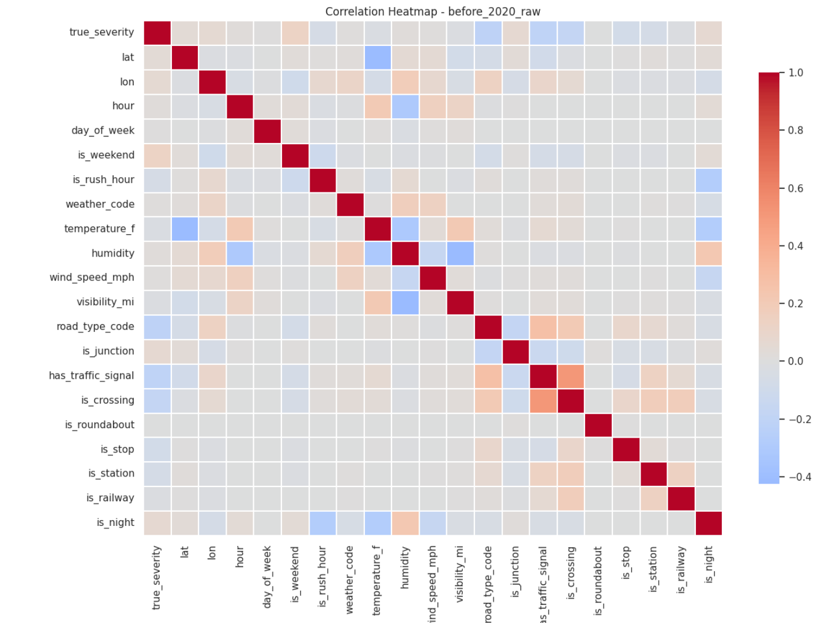

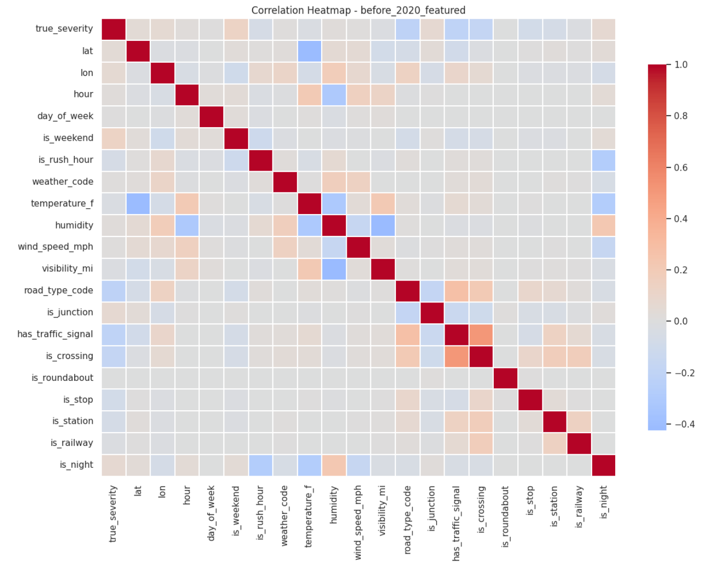

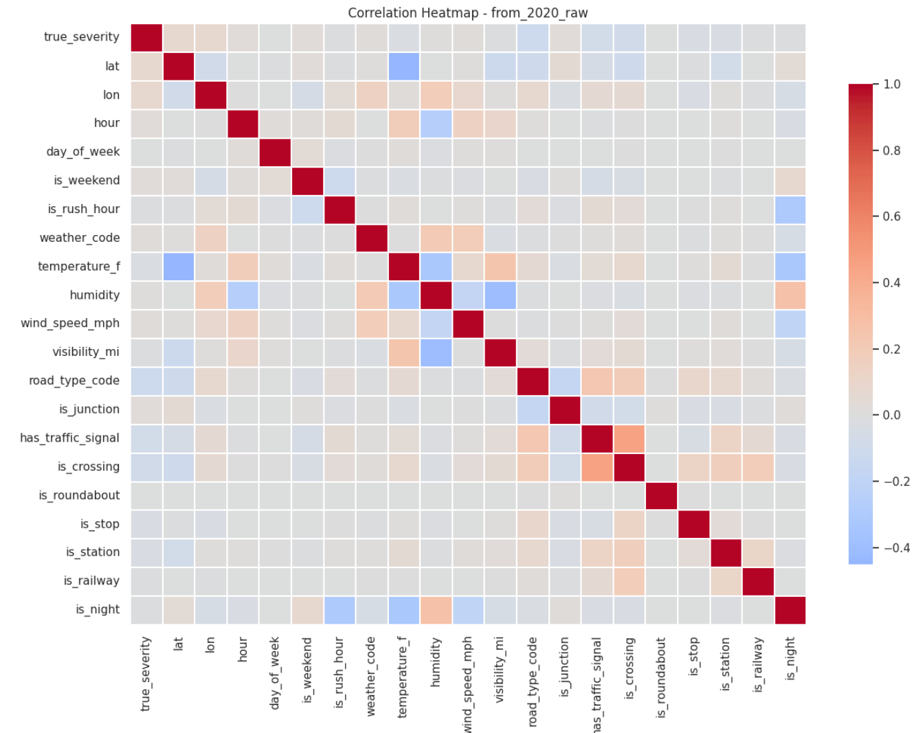

## Top correlation với true_severity trước 2020

| Feature | Correlation với `true_severity` |
| --- | --- |
| `road_type_code` | -0.2151 |
| `has_traffic_signal` | -0.2082 |
| `is_crossing` | -0.1746 |
| `is_weekend` | 0.1309 |
| `is_stop` | -0.0777 |
| `is_night` | 0.0689 |
| `is_junction` | 0.0665 |
| `is_station` | -0.0643 |
| `lon` | 0.0552 |
| `is_rush_hour` | -0.0529 |

## Nhận xét

Không có feature đơn lẻ nào có correlation cực mạnh với severity. Feature mạnh nhất cũng chỉ khoảng `|0.21|`.

Điều này nghĩa là severity không thể dự đoán tốt bằng một feature đơn giản. Model cần học tương tác giữa nhiều feature.

Ví dụ:

```
road_type_code + hour + is_night + weather_code + lat lon
```

có thể hữu ích hơn từng feature riêng lẻ.

## Đánh giá

Correlation heatmap ủng hộ việc dùng:

- Random Forest
- XGBoost
- H2O AutoML
- tree-based models

hơn là chỉ dùng linear model.

---

# 13. Spatial scatter plot

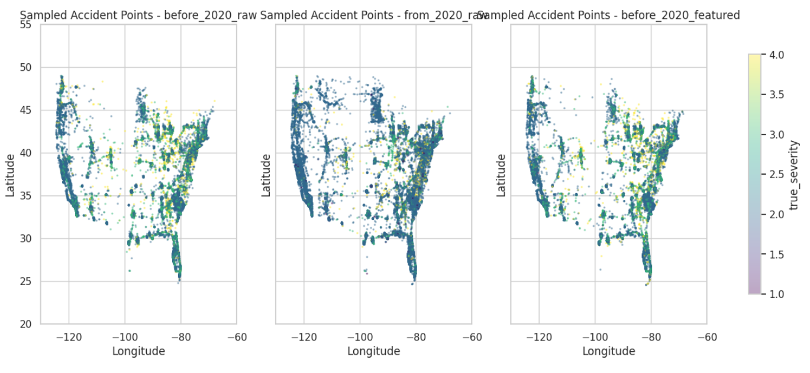

## Nhận xét

Các điểm accident nằm đúng trong phạm vi bản đồ Hoa Kỳ:

- Longitude khoảng từ -125 đến -67
- Latitude khoảng từ 24 đến 49

Các điểm tập trung nhiều ở:

- California,
- Texas,
- Florida,
- miền Đông Hoa Kỳ,
- các vùng đô thị và hành lang giao thông lớn.

## Đánh giá

Spatial sanity check tốt. `lat` và `lon` hợp lệ, không có điểm lệch rõ ràng ra ngoài vùng Mỹ.

Tuy nhiên, chỉ dùng raw `lat/lon` có thể chưa đủ mạnh. Model có thể cải thiện nếu thêm feature không gian như:

- state,
- city,
- county,
- road segment,
- geohash,
- spatial grid,
- distance to urban center.

---

# 14. Đánh giá data drift giữa before 2020 và from 2020

Đây là điểm rất quan trọng.

## Drift lớn nhất nằm ở label distribution

| Severity | Before 2020 | From 2020 | Thay đổi |
| --- | --- | --- | --- |
| 1 | 0.03% | 1.75% | Tăng mạnh |
| 2 | 67.03% | 85.11% | Tăng mạnh |
| 3 | 29.83% | 10.86% | Giảm mạnh |
| 4 | 3.10% | 2.28% | Giảm nhẹ |

## Đánh giá

Sau 2020, severity 2 áp đảo hơn rất nhiều, còn severity 3 giảm mạnh. Đây là dấu hiệu drift lớn.

Điều này có thể đến từ:

- thay đổi cách thu thập dữ liệu,
- thay đổi reporting policy,
- dữ liệu sau 2020 khác bản chất,
- dữ liệu 2023 chưa đầy đủ,
- ảnh hưởng giai đoạn COVID lên traffic pattern.

## Kết luận

Không nên đánh giá model chỉ bằng cách trộn before và after 2020. Cách hiện tại của bạn là hợp lý:

```
before 2020: offline pretraining
from 2020: streaming replay and drift observation
```

---

# 15. Đánh giá feature engineering

## Điểm tốt

| Điểm | Đánh giá |
| --- | --- |
| Schema thống nhất | Tốt |
| Missing values sau engineering | 0 |
| Weather features được clip | Tốt |
| Road type được encode | Có ích |
| Boolean flags được chuẩn hóa 0/1 | Tốt |
| before raw và before featured gần giống nhau | Chứng minh pipeline ổn định |

## Điểm cần cải thiện